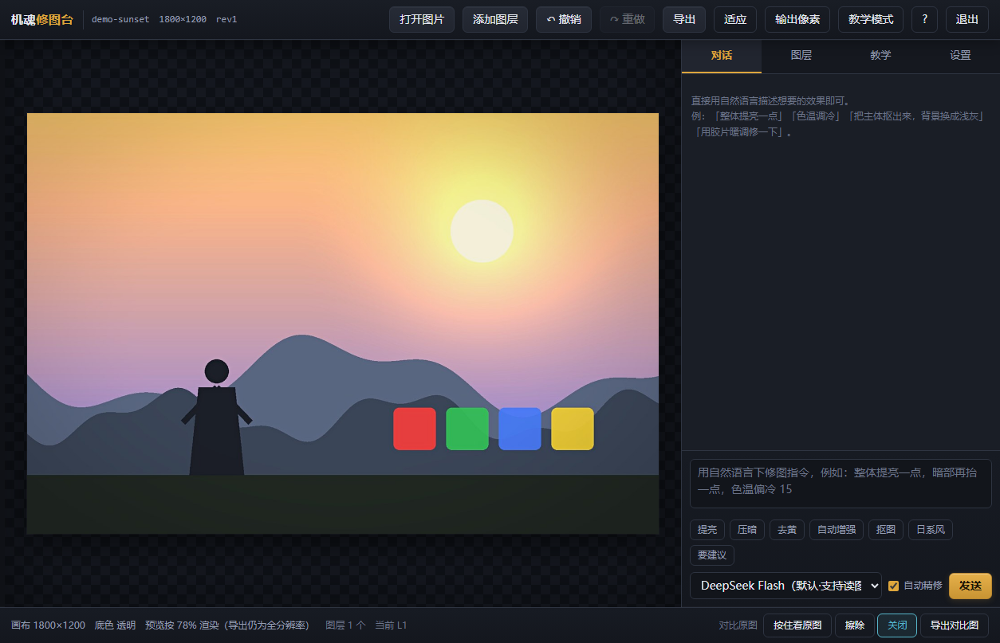
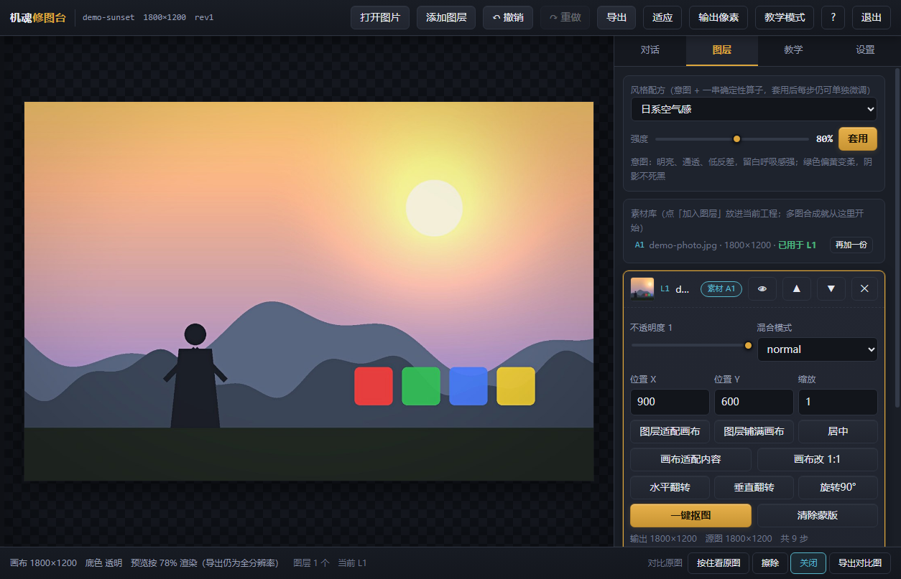
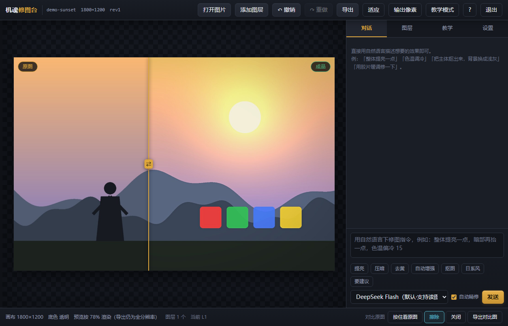
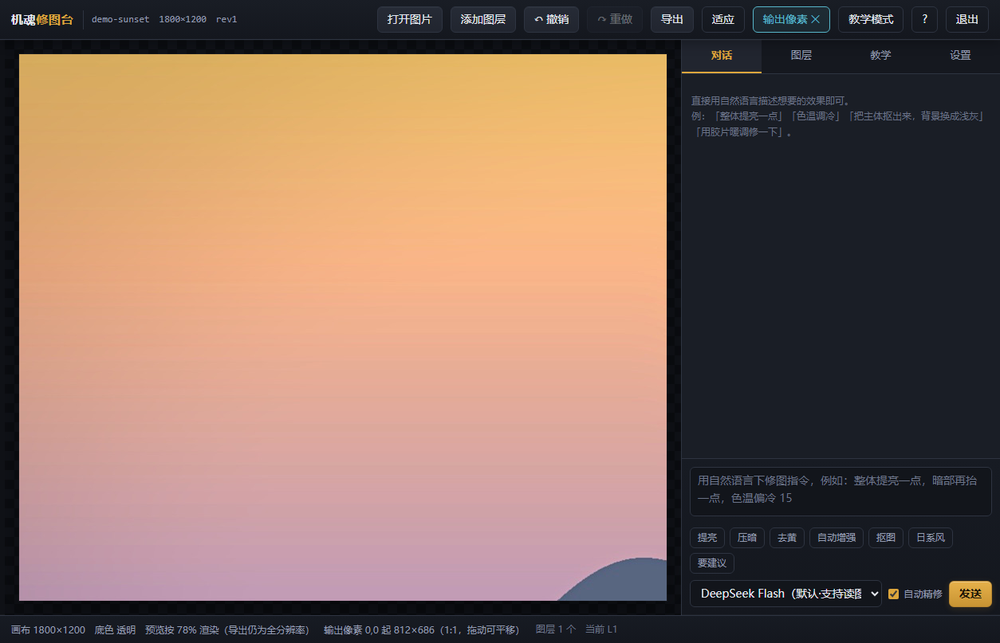
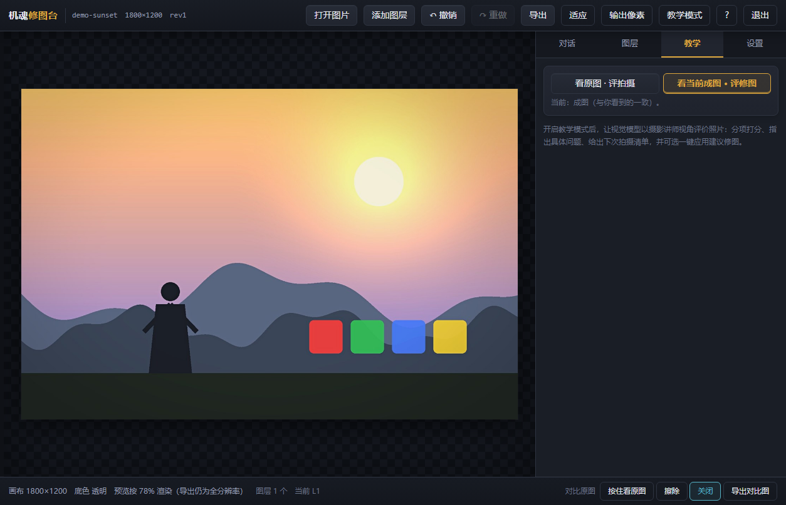
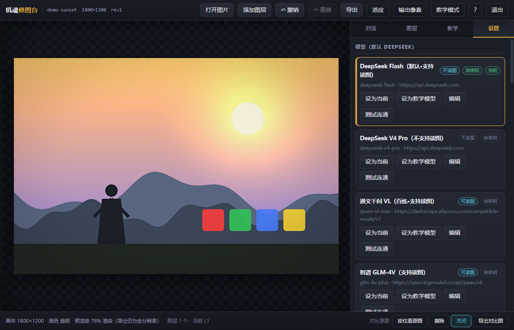

# AI Retouching Console · 机魂修图台

> **让 AI 去「操控修图工具」，而不是重绘原图。**

[](https://www.python.org/)
[](LICENSE)
[](#)
[](#测试与验证)
[](#项目结构)

一个跑在本机的轻量修图台：你在对话框里用自然语言说想要什么，AI 把它翻译成**结构化的编辑指令**，
由本地确定性算子逐条执行。它能调色、抠图、多图合成，能当摄影老师点评你的照片，还能按风格配方一键出片。



---

## 项目构想

> 现在的 AI 图像编辑本质上是对原图进行重绘，所以在细节微调上总是做的不太好；故欲设计一套方案，让 AI 去操控图像编辑工具去修图。
>
> 1. 尽可能轻量化，只需要最基本的一些功能，包括：调色、抠图、多图合成；
> 2. 设置对话框，用自然语言控制；
> 3. 设置教学模式，开启后对照片进行评价并给出提升拍照技术的建议；
> 4. 设置多模型切换功能，默认先用 deepseek。

这份构想正是本项目的出发点与验收标准，四条诉求的落地情况：

| 构想 | 落地情况 |
| --- | --- |
| **AI 操控工具，而非重绘** | AI 只输出 JSON 指令（48 个算子），**从不接触像素**；所有像素变化由本地确定性算子完成，源文件永不改写，每一步都可无损撤销、可重放 |
| **1. 轻量化：调色 / 抠图 / 多图合成** | 调色 40+ 个非破坏性算子（基础影调、HSL、分离色调、暗角、颗粒、清晰度、锐化…）；抠图走离线 BiRefNet/RMBG，缺权重时自动降级 OpenCV GrabCut；多图层合成（9 种混合模式、位置/缩放/不透明度、图层级管线） |
| **2. 对话框自然语言控制** | 对话页说人话即可：「整体提亮一点，色温调冷」「把人物抠出来，背景换成纯白」「用胶片暖调修一下，强度 70」；AI 会先给意图与诊断，再列将要执行的步骤 |
| **3. 教学模式** | 对照片打分并从曝光、主体、构图、色彩、清晰度等维度给出**具体问题位置 + 提升清单**；可选择点评"原图（评拍摄）"还是"当前成图（评修图）" |
| **4. 多模型切换，默认 DeepSeek** | 内置多家 OpenAI 兼容端点预设（默认 DeepSeek），可自由增删；支持为教学单独指定模型；密钥只存本地 `config/settings.json`，不进仓库 |

---

## 它解决什么问题

主流 AI 图像编辑是"重绘"：模型看过原图后画一张新的。结果是
**细节会被"编"出来**——睫毛、砖缝、文字、噪点纹理都可能在两张图之间漂移；
想要"只把暗部提一点、其他一模一样"这种诉求，它做不到。

本项目换一条路：**把 AI 当作"会看图的修图指令翻译器"**。

```
你的自然语言
      ↓
  AI（视觉模型）→ 读图 + 出意图 + 输出 JSON 指令
      ↓
  算子校验（48 个算子的参数契约，越界/未知直接拒绝）
      ↓
  本地确定性执行（numpy / Pillow，不联网、不重绘）
      ↓
  非破坏性管线（源图不动，随时撤销/重放/微调单步）
```

由此得到几个实际好处：

* **细节零漂移** —— 没被指令覆盖的像素，逐位不变；
* **可微调** —— 每个算子都能事后单独改参数（滑杆微调），不必重新描述一遍；
* **可复现** —— 同一份指令在任何机器上跑出同一张图（工程只存"配方 + 源图副本"）；
* **可解释** —— AI 干了什么、为什么这么干，都在对话里列成步骤；
* **可控成本** —— 一次对话只调用一次模型；此后所有调整全是本地运算。

---

## 功能

**调色与几何**
- 40+ 调色算子：曝光/对比/高光阴影/白黑场/饱和度/自然饱和度/色温色调/HSL 分区/分离色调/曲线/清晰度/锐化/降噪/暗角/颗粒/褪色 等
- 几何：裁切、比例裁切、水平校正、旋转、翻转、缩放；裁切后可选自动适配画布（避免导出留白边）
- 13 套风格配方（日系空气感、胶片暖调、通透风光、电影青橙、清冷人像 等），强度可调，套用后**每一步都能单独微调**

**抠图与合成**
- 离线抠图：BiRefNet / RMBG-2.0（本地权重）；没有权重时自动降级 OpenCV GrabCut，并如实告知
- 图层合成：多图层、9 种混合模式、不透明度、位置/缩放、图层级管线、蒙版
- 素材库会标注每个素材**已用于哪些图层**，点击即跳到对应图层

**对话与教学**
- 自然语言下指令；AI 输出意图 + 诊断 + 步骤清单
- 自动复核（refine）：AI 执行后自行检查结果，必要时追加最多 N 步修正
- 教学模式：评分 + 问题定位 + 拍摄建议；可切换点评对象（原图 / 当前成图）
- 多模型：DeepSeek 默认，兼容任意 OpenAI 格式端点；教学可单独指定模型

**查看与对比**
- 原图对比：按住 `\` 瞬时看原图、擦除模式左右分割、导出对比图
- **输出像素查看**：服务端按视口全分辨率渲染，1:1 判断锐化与噪点（拖动平移）
- 长管线折叠：步骤超过 8 步时自动折叠中间段，微调目标所在图层强制展开

**工程与数据**
- 非破坏性管线 + 快照撤销（60 步）
- RAW 支持：CR3/CR2/NEF/ARW/DNG 等 18 种扩展名，三条解码路径自动降级
- 工程即文件夹（`document.json` 记配方 + `sources/` 存源图副本），可直接拷走

---

## 截图

| 对话修图 | 图层面板 |
| --- | --- |
|  |  |

| 原图对比（擦除） | 输出像素查看（1:1） |
| --- | --- |
|  |  |

| 教学模式 | 模型设置 |
| --- | --- |
|  |  |

> 截图使用程序生成的合成示例图（`tools/make_demo_photo.py`），不含任何个人照片。

---

## 快速开始

### 环境要求

- Python **3.10+**
- 操作系统：Windows / macOS / Linux（Windows 上额外支持系统 RAW 解码，见下文）
- 可选：`torch` + `opencv-python`（启用 AI 抠图）；`rawpy`（启用真 RAW 解码）
- 一个支持读图的模型 API Key（默认 DeepSeek；不配也能用全部本地功能）

### 安装

```bash
git clone https://github.com/godme6661/AI-Retouching-Console.git
cd AI-Retouching-Console

python -m venv .venv
# Windows:  .venv\Scripts\activate
source .venv/bin/activate

pip install -r requirements.txt
```

`requirements.txt` 只含运行必需的核心依赖；抠图与 RAW 的重型可选依赖见文件内注释。

### 启动

```bash
# Windows：双击  启动机魂修图台.bat
# macOS / Linux：
./run.sh

# 或手动指定端口
python -m cogitator --port 8760
```

浏览器会自动打开 `http://127.0.0.1:8760/`（不会自动打开时手动访问即可）。

### 配置模型（可选）

复制示例配置并填入自己的密钥：

```bash
cp config/settings.example.json config/settings.json
```

也可以直接用环境变量（优先级更高，不必写进配置文件）：

```bash
export DEEPSEEK_API_KEY="sk-..."          # Windows: set DEEPSEEK_API_KEY=sk-...
```

> `config/settings.json` 已被 `.gitignore` 排除，密钥不会进仓库。
> **配置只保存在本机**，界面上的"测试连通"会真实调用一次接口确认可用。

**没有任何密钥也能用**：调色、几何、图层合成、导出这些全在本地完成，不联网。

### AI 抠图权重（可选）

默认走 OpenCV 兜底；想要更好的边缘，需要自行获取 BiRefNet / RMBG-2.0 权重：

```bash
export RMBG_MODEL_DIR="/path/to/RMBG-2.0"   # 或写进 settings.json 的 matting.model_dir
```

> ⚠️ **权重许可**：RMBG-2.0 由 BRIA 发布，遵循其自有许可（`bria-rmbg-2.0`），
> **商业使用需另行授权**。本项目**不包含也不分发任何模型权重**，请自行获取并遵守其条款。
> 参见官方仓库：<https://github.com/Bria-AI/RMBG-2.0>

---

## 使用

### 对话修图

在右侧对话框里直接说，例如：

| 说法 | AI 会做什么 |
| --- | --- |
| `整体提亮一点，暗部再抬一些` | 曝光 +0.2、阴影 +15 之类的组合 |
| `色温调冷，饱和度降一点` | 色温 −10、饱和度 −8 |
| `把人物抠出来，背景换成浅灰` | 抠图生成蒙版 → 新建纯色底层 |
| `用胶片暖调修一下，强度 70` | 套用风格配方并缩放到 70% 强度 |
| `天空太亮了，压一点但别发灰` | 高光 −20 + 对比微调，并说明取舍 |

AI 的回复包含三段：**意图**（它理解成了什么）、**诊断**（它看图发现了什么）、**步骤**（将执行哪些算子）。
执行前会过一遍算子契约校验，越界或拼错的指令会被拒绝并说明原因。

### 教学模式

切到「教学」标签页，选择点评对象：

- **看原图 · 评拍摄** —— 点评构图、曝光、对焦等拍摄层面的问题
- **看当前成图 · 评修图** —— 点评修图是否过头、方向是否正确

输出为多维度评分 + 具体问题 + 可执行的提升清单。

### 图层与合成

- 「添加图层」把新图片作为素材加入，再「加入图层」进入画布
- 每个图层有自己的管线与混合模式，可单独微调
- 步骤超过 8 步会自动折叠中间段（点击展开），避免长管线滚不到头

### 快捷键

| 按键 | 作用 |
| --- | --- |
| `\`（按住） | 临时看原图，松开回成品 |
| `Ctrl+Z` / `Ctrl+Y` | 撤销 / 重做 |
| `Ctrl+S` | 打开导出对话框 |
| `Ctrl+V` | 粘贴剪贴板图片 |
| `?` | 快捷键帮助 |
| `Esc` | 关闭当前对话框 |

---

## 工作原理

**为什么不让 AI 碰像素**，是这个项目最重要的设计取舍。

模型输出的是这样的东西（示意）：

```json
{ "intent": "整体提亮并降低色温",
  "diagnosis": "画面偏暗，高光已经接近溢出",
  "ops": [
    { "op": "exposure", "value": 0.22, "layer": "L1" },
    { "op": "highlights", "value": -12, "layer": "L1" },
    { "op": "temperature", "value": -8, "layer": "L1" }
  ] }
```

这份输出必须通过算子契约校验：`cogitator/ops.py` 里的 `SPECS` 是**唯一的契约来源**，
它同时负责参数校验、生成给模型看的使用手册、以及索引到具体实现。
校验通过后，`document.py` 把算子追加进该图层的有序管线，渲染时从头重放。

这么做换来三件事：

1. **可撤销**：撤销就是"弹出最后一批算子"，不需要保存历史像素；
2. **可复查**：任何一步都能改参数重放，AI 与人都能回溯"是哪一步把画面搞成这样"；
3. **跨机一致**：工程文件里只有配方与源图副本，换机器渲染结果一致（RAW 解码差异只影响导入那一刻）。

补充两个工程细节：

* **预览按显示尺寸渲染**（默认最长边 1400px），像素单位参数按渲染比例同步缩放，
  与"全分辨率渲染再缩小"在数值上等价（自检里有断言），所以预览是可信的；
  需要判断锐化时用「输出像素」看真 1:1。
* **RAW 三条解码路径**：`rawpy`（装了就用）→ Windows 系统 WIC → CR3 文件内嵌 JPEG 保底。
  解码只发生在导入时，结果落盘为普通图片，因此**已建工程在任何机器上渲染都一样**。

---

## 项目结构

```
cogitator/            应用主体（FastAPI + numpy/Pillow，无前端构建）
  ops.py              48 个算子的唯一契约来源（校验/手册/实现索引）
  document.py         非破坏性管线、图层合成、快照撤销、导出
  image_ops.py        调色与几何算子实现（含渲染比例换算）
  render.py           渲染与预览
  matting.py          抠图：BiRefNet 离线 + GrabCut 兜底
  raw_io.py           RAW 解码三条路径
  agent.py llm.py     对话链路：提示词组装、模型调用、JSON 容错解析
  teaching.py         教学模式
  styles.py styles.json   13 套风格配方
  server.py           34 个 HTTP 路由
  web/                原生 HTML/CSS/JS 前端（零构建）
skills/aesthetics/    审美知识库：常驻核心 + 11 份按需参考（构图/光影/色彩/人像/街拍…）
tools/                自检与开发工具（见下）
docs/                 设计文档与截图
samples/              （可选）放一张 RAW 供解码相关自检使用
```

---

## 测试与验证

这个项目的自检力度比功能代码还大——**因为"AI 会犯错"和"像素很诚实"这两件事都可以被断言**。

```bash
python tools/selftest_ops.py         #  78 项：算子契约、校验器、调色数值、几何预演、端口探测
python tools/selftest_doc.py         #  89 项：像素端到端、撤销重做、图层合成、风格配方、预览↔导出等价
python tools/selftest_skills.py      #  41 项：技能包解析、按需加载、配方逐条过注册表、强度缩放
python tools/selftest_agent.py       #  54 项：假模型驱动整条对话链路（含畸形 JSON 容错）
python tools/check_json_tolerance.py #  17 项：真实模型会吐出的畸形 JSON 逐条体检
python tools/selftest_raw.py         #  32 项（提供 RAW 样本后 67 项）：三条解码路径、字节一致性、EXIF 方向
python tools/selftest_shutdown.py    #  26 项：静态守卫与退出链路（防止"点了没反应"复发）

# 端到端（真实 HTTP，默认不调用真实模型、不花你的额度）
python -m cogitator --port 8791 --no-browser
python tools/e2e_check.py --base http://127.0.0.1:8791     # 97 项（提供 RAW 样本后 103 项）
```

还有三层**驱动真实浏览器**的交互检查（用 CDP，零依赖，本机有 Edge/Chrome 即可）：

```bash
node tools/check_quit_ui.mjs      --base http://127.0.0.1:8791   #  6 项：点「退出」必须真有反应
node tools/check_compare_ui.mjs   --base http://127.0.0.1:8791   # 18 项：对比交互（拖动不得误加图层等）
node tools/check_ui_extras.mjs    --base http://127.0.0.1:8791   # 41 项：缩放/输出像素/面板/快捷键/折叠/素材归属
```

**共 434 项断言**（提供 RAW 样本后 475 项）+ 65 项浏览器交互检查。

其中不少断言是**为了记住曾经踩过的坑**，例如：

* 原生 `confirm()` 被浏览器静默阻止 → 界面按钮"点了没反应"（已改为应用内确认框，且保留间谍断言）；
* `` 默认可拖拽，Chrome 会把页面内的图塞进 `dataTransfer.files` → 拖动对比分割线时把预览图叠到了画布上；
* 预览是下采样栅格，**不能**用它判断输出像素级锐化 → 状态栏措辞有断言守着，禁止写回"1:1 检查"；
* `.bat` 必须是 CRLF 换行，否则 cmd 解析中文行报出莫名其妙的错误。

---

## 已知限制

如实列出，避免误解：

* **预览不是输出像素**：预览按显示尺寸渲染（默认最长边 1400px），判断锐化/噪点请用「输出像素」看真 1:1；
* **样式强度不缩放所有参数**：`feather / size / radius / width` 这类几何或蒙版参数不随风格强度线性缩放；
* **RAW 默认走内嵌预览**：未安装 `rawpy` 时取的是相机在文件里写好的 JPEG 预览——分辨率完整、但没有 RAW 高光宽容度。
  Windows 上若装了系统 RAW 扩展，会自动走 WIC 真解码（实测高光宽容度好约 30 倍，但整体偏暗需自行补影调）；
* **输出像素查看模式不支持原图对比**：该模式显示的是服务端裁出的视口，与下采样预览的对比基准尺寸不同，硬叠会对不齐；
* **修改技能包后需手动重载**：`skills/` 下改动不会热生效；
* **抠图权重需自备**，且 RMBG-2.0 为**非商业**许可（详见上文）；
* 大批量导出、云同步、移动端适配均未实现（本项目的定位是"本机轻量修图台"）。

---

## 常见问题

| 现象 | 原因与处理 |
| --- | --- |
| 双击 `.bat` 后窗口一闪而过 | 用 `run.sh` / 手动 `python -m cogitator --port 8760` 起，看报错信息；`.bat` 只做环境检查与启动 |
| 页面打开了但按钮"点了没反应" | 多半是浏览器缓存了旧前端：`Ctrl+F5` 强刷；服务已对静态资源发 `no-store` |
| 对话报"返回 JSON 格式不对" | 模型输出了畸形 JSON。解析层已能容错注释/尾随逗号/全角标点/截断，仍失败会自动追问一次；若持续失败，换一个更强的模型试试 |
| 抠图效果差 | 未装权重时走 OpenCV 兜底，边缘自然一般；按上文配置 `RMBG_MODEL_DIR` 可显著改善 |
| 导入 CR3 后画面偏暗 | 那是 WIC 真解码的结果（保留了高光、欠曝），补一点曝光即可；想回到相机直出观感可把 `raw.decode` 设为 `embedded-jpeg` |
| 显存/内存吃紧 | 抠图模型约需 2GB+；不启用抠图时整个应用是纯 CPU、内存占用很低 |

---

## 参与贡献

欢迎提 Issue 与 PR。几条约定：

1. **改动请带验证**：新增算子或修行为，请在 `tools/selftest_*.py` 里加断言（这是本项目最看重的部分）；
2. **不要引入外部前端依赖**：前端是零构建的原生 HTML/CSS/JS，这条是为"轻量、离线可用"服务的；
3. **不要把密钥、个人路径写进代码**：一律走环境变量或 `config/settings.json`；
4. 提交前跑一遍：

```bash
python tools/selftest_ops.py && python tools/selftest_doc.py && \
python tools/selftest_skills.py && python tools/selftest_agent.py && \
python tools/selftest_shutdown.py
```

---

## 许可

本项目代码以 **MIT** 许可发布，见 [LICENSE](LICENSE)。

**不包含**第三方模型权重；RMBG-2.0 的权重遵循 BRIA 自有许可（非商业），
商业使用请向权利方申请授权。其余依赖均为宽松许可（MIT / BSD / Apache-2.0），
rawpy 内置的 LibRaw 为 LGPL-2.1 / CDDL（动态链接使用）。

## 致谢

* [BiRefNet](https://github.com/ZhengPeng7/BiRefNet) / [BRIA RMBG-2.0](https://github.com/Bria-AI/RMBG-2.0) —— 抠图模型
* [FastAPI](https://fastapi.tiangolo.com/) / [Pillow](https://python-pillow.org/) / [NumPy](https://numpy.org/) / [OpenCV](https://opencv.org/) / [PyTorch](https://pytorch.org/) / [rawpy](https://github.com/letmaik/rawpy)
* 审美知识库的编写参考了公开的摄影与后期资料，来源与要点见 `skills/aesthetics/`；正文为本项目自行撰写

> 如果这个项目对你有帮助，欢迎 Star ⭐ 或把它用在你自己的修图流程里。
